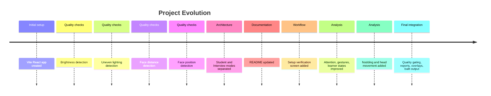

# Development History: Body Language Monitor

## Purpose of This Document

This document summarizes how the project appears to have evolved based on the git commit history, current source tree, and implemented features. It is written for dissertation and handover purposes, not as a strict changelog with every line-level change.

## Current Branch and History Source

Observed branch:

```text
musaib-work
```

Recent commit trail:

```text
31c0bf0 final
033948c nodding added
a232153 final baseline Model
50b092c improved features
8154a16 remove accidental file from git error
438f416 added setup screen
148ee8e Merge branch 'temp-save' into musaib-work added setup screen
639cd07 setup screen finished
671ce89 setup screen
8bd5799 setup screen finished
faefc83 Edit README.md
95034df seperated interview and student modueles
7f185ee Faceposition checkadded
8844898 added face distance
84e84f1 added uneven light detection
4a7e009 Added brightness detection improvements
52a7057 cleanup
240e22d first push
f54b721 Initial commit
```

## Phase 1: Initial React/Vite Application

Likely commits:

- `f54b721 Initial commit`
- `240e22d first push`
- `52a7057 cleanup`

The project began as a Vite React application. Core project files such as `index.html`, `vite.config.js`, `package.json`, `src/main.jsx`, `src/App.jsx`, and `src/styles.css` formed the initial browser app foundation.

At this stage, the likely focus was:

- Establishing React rendering.
- Setting up Vite scripts.
- Creating the initial UI shell.
- Preparing the project for browser-based camera and vision work.

## Phase 2: Brightness and Basic Video Quality

Likely commit:

- `4a7e009 Added brightness detection improvements`

The project then added brightness analysis. This is represented in the current code by:

- `src/modules/shared/detection/getBrightness.js`
- `src/modules/shared/detection/getFaceBrightness.js`
- `src/modules/shared/check/brightnesscheck.js`

The brightness implementation computes average RGB intensity and classifies the camera image as too dark, acceptable, good, slightly bright, or too bright. This became one of the earliest quality gates.

## Phase 3: Uneven Lighting Detection

Likely commit:

- `84e84f1 added uneven light detection`

The next quality improvement was lighting balance. This is represented by:

- `src/modules/shared/detection/getCheekBrightness.js`
- `src/modules/shared/check/unevenlightingcheck.js`

The implementation samples small image regions around left and right cheek landmarks, calculates percentage difference, and converts that difference into a lighting balance status.

This phase improved reliability because face analysis can be misleading when one side of the face is strongly shadowed or overexposed.

## Phase 4: Face Distance Detection

Likely commit:

- `8844898 added face distance`

Face distance was introduced by estimating normalized face area from landmarks:

- `src/modules/shared/detection/getFacebox.js`
- `src/modules/shared/detection/getFaceArea.js`
- `src/modules/shared/check/facedistancecheck.js`

The current implementation treats very small face area as too far from the camera and very large area as too close. This supports both setup verification and live quality gating.

## Phase 5: Face Position Detection

Likely commit:

- `7f185ee Faceposition checkadded`

Face position checking was added to detect whether the face is centered:

- `src/modules/shared/detection/getFaceCenter.js`
- `src/modules/shared/check/facepositioncheck.js`

The current implementation expects face center coordinates to be between `0.4` and `0.6` on both axes. If the face remains off-center for more than three seconds, the system can show a warning.

## Phase 6: Student and Interview Mode Separation

Likely commit:

- `95034df seperated interview and student modueles`

The project was split into separate mode wrappers:

- `src/modes/StudentMode.jsx`
- `src/modes/InterviewMode.jsx`
- `src/modeSelector.jsx`
- `src/StudentAttentionMonitor.jsx`
- `src/InterviewMonitor.jsx`

This introduced the concept of two application contexts:

- Student analysis
- Interview assessment

However, in the current code, Interview Mode still reuses most student-style analysis logic and terminology. The architectural split exists, but the interview-specific analytics are only partially developed.

## Phase 7: README Documentation Update

Likely commit:

- `faefc83 Edit README.md`

The README was updated to describe:

- Browser-based body language monitoring.
- Student and Interview modes.
- MediaPipe usage.
- Setup and run commands.
- Privacy note that video is not uploaded by the app.
- Recommended future improvements.

This made the repository easier to understand and run.

## Phase 8: Setup Screen Development

Likely commits:

- `8bd5799 setup screen finished`
- `671ce89 setup screen`
- `639cd07 setup screen finished`
- `148ee8e Merge branch 'temp-save' into musaib-work added setup screen`
- `438f416 added setup screen`

The setup screen became a major feature:

- `src/components/setupScreen.jsx`

It performs pre-session checks before the user reaches the monitor:

- Camera permission
- Face detection
- Proper lighting
- Balanced lighting
- Correct distance
- Face centered
- Camera focus

It also introduced:

- Live preview
- Face guide overlay
- Readiness badge
- Checklist panel
- Disabled start button until checks pass

This phase shifted the project from pure live analysis toward a more robust workflow where data quality is validated before behavioral scoring begins.

## Phase 9: Feature Improvements and Baseline Model

Likely commits:

- `50b092c improved features`
- `a232153 final baseline Model`

This phase appears to have expanded the behavioral pipeline. The current code includes:

- Attention calculation from blendshapes and head pose.
- Gesture detection for raise hand, thumbs up, and thumbs down.
- Learner-state scoring.
- Landmark overlay drawing.
- Quality popups.
- Sparkline display.
- FPS reporting.

Important modules from this phase likely include:

- `src/modules/student/attentionTracking.js`
- `src/modules/student/raiseHandDetection.js`
- `src/modules/student/learnerStateAnalysis.js`
- `src/modules/student/gestureDecision.js`
- `src/modules/shared/Engine/videoQualityEngine.js`

The term "baseline model" should be interpreted carefully. The repository does not contain a custom trained model. The baseline is a heuristic application model layered over MediaPipe's pretrained face and hand models.

## Phase 10: Nodding and Head Movement

Likely commit:

- `033948c nodding added`

Nodding was added as part of agreement detection. The current implementation uses recent pitch changes from the face transformation matrix:

- Head pose is extracted in the monitor components.
- Recent pitch samples are stored in `runtime.headHist`.
- `recentChangeDeg(runtime, "pitch")` estimates nod movement.
- Student Mode smooths nodding with an EMA and counts activation transitions.

Disagreement also uses head movement through yaw oscillation and direction reversals.

## Phase 11: Final Integration

Likely commit:

- `31c0bf0 final`

The current repository represents an integrated prototype with:

- Setup verification.
- Student and Interview mode wrappers.
- Live MediaPipe inference.
- Face and hand overlays.
- Video quality checks.
- Quality engine and active popups.
- Attention scoring.
- Gesture scoring.
- Learner-state scoring.
- Student session reporting.
- Built production output in `dist/`.

## Current Working Tree Notes

At the time this documentation was generated, the working tree already contained modifications and untracked files unrelated to this documentation task. These include changes in monitor components, shared quality modules, student analysis modules, generated `dist` assets, and the newly documented `missingFaceCheck.js`.

Those existing changes were not reverted or modified while generating these documentation files.

## Feature Timeline Summary



## Architecture Maturity Over Time

### Early Stage

The project likely started with a direct monitor implementation inside the React app. The main achievement was proving that webcam frames could be processed in the browser.

### Middle Stage

The code began to separate reusable checks into modules under `src/modules/shared`. This improved maintainability for brightness, distance, lighting, face position, blur, occlusion, and multi-face logic.

### Current Stage

The project now has a clear conceptual architecture, but some implementation consolidation remains:

- Shared modules exist.
- Mode wrappers exist.
- Quality engine exists.
- Student analysis modules exist.
- Monitor orchestration is still duplicated between Student and Interview components.

## Completed Milestones

- Browser app scaffolded.
- MediaPipe integrated.
- Camera capture implemented.
- Face landmark detection implemented.
- Hand landmark detection implemented.
- Brightness detection implemented.
- Uneven lighting detection implemented.
- Face distance detection implemented.
- Face position detection implemented.
- Blur detection implemented.
- Occlusion detection implemented.
- Multi-face detection implemented.
- Missing-face detection implemented.
- Setup verification implemented.
- Student/Interview mode selection implemented.
- Attention scoring implemented.
- Gesture detection implemented.
- Learner-state scoring implemented.
- Quality gating implemented.
- Student session report implemented.

## Partially Completed Milestones

- Interview Mode is structurally present but not analytically distinct.
- Report generation exists for Student Mode only.
- Quality modules are separated, but full monitor orchestration is not.
- README exists, but dissertation-level documentation needed these additional files.
- Build output exists, but there is no automated validation workflow.

## Development Patterns Observed

- Feature-first implementation: functionality was added incrementally by capability.
- Progressive modularization: repeated quality logic was gradually moved into `modules/shared`.
- Heuristic tuning: thresholds and weighted scores are hardcoded in modules.
- Browser-only privacy design: no server-side processing was introduced.
- Manual validation: no test framework is configured.

## Lessons for Future Development

- Separate shared monitor runtime logic before adding more modes.
- Treat Interview Mode as a separate domain and give it its own scoring module.
- Add automated tests before changing threshold-heavy modules.
- Move hardcoded thresholds into a configuration layer.
- Add calibration so the system adapts to camera and lighting conditions.
- Create a small labeled video dataset for repeatable evaluation.
- Keep documentation updated when feature names and mode responsibilities change.

## Suggested Next Commits

1. `docs: add project context and implementation history`
2. `refactor: extract shared vision monitor runtime`
3. `test: add unit coverage for quality checks`
4. `feat: add interview-specific report`
5. `fix: repair encoded gesture icons`
6. `docs: add evaluation protocol for dissertation`
