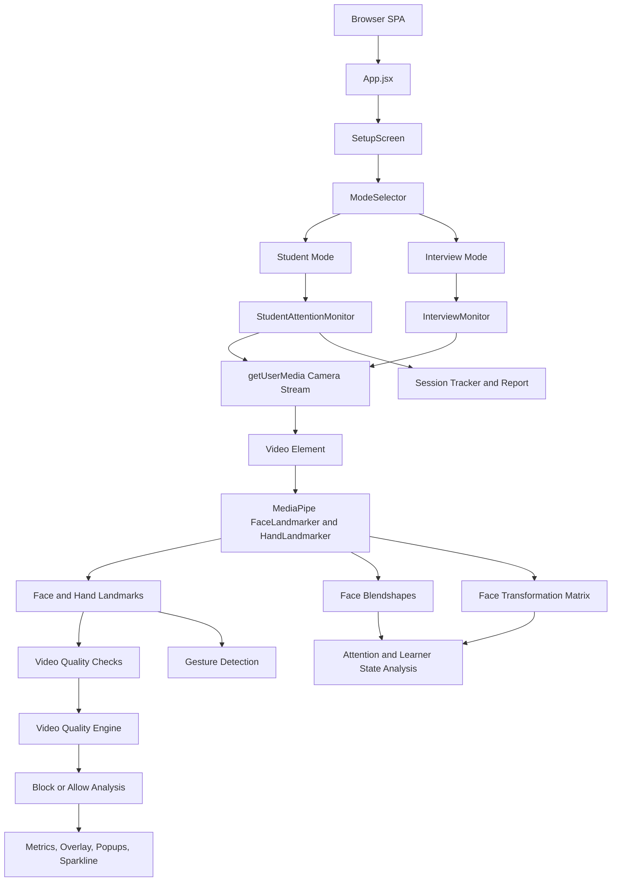
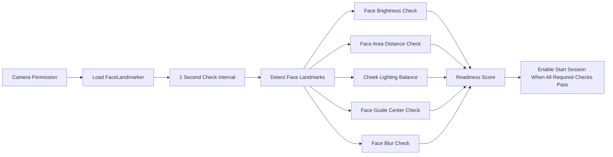
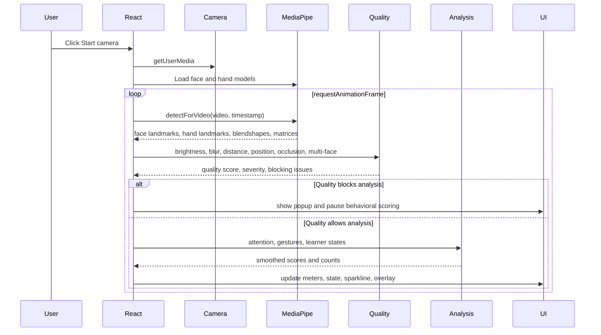
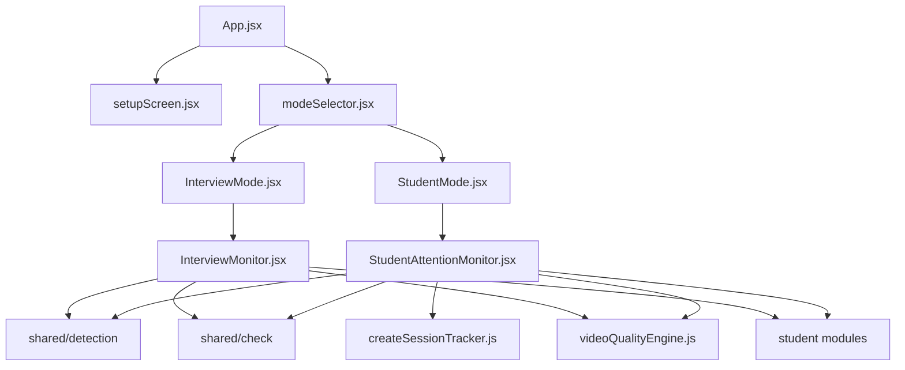
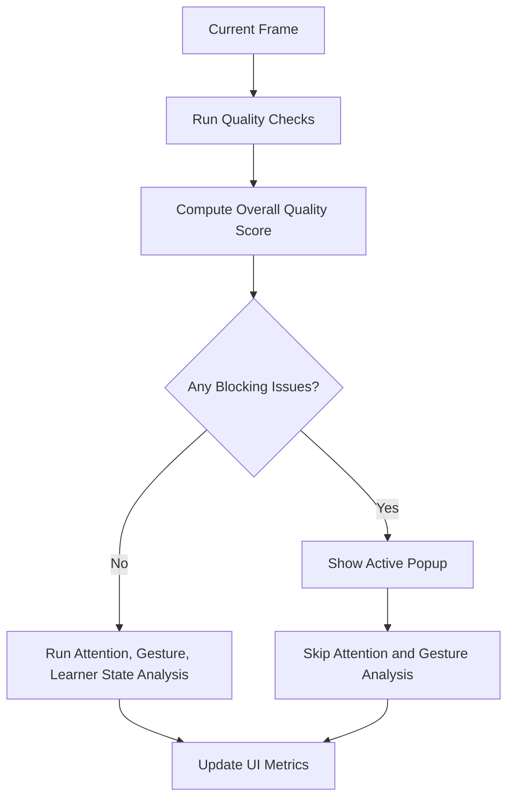
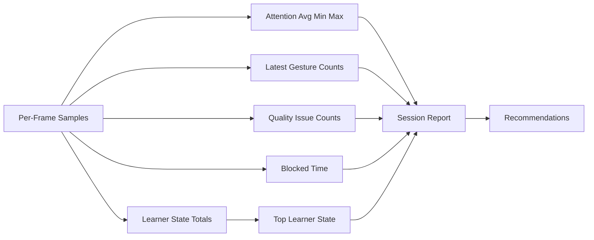

# Project Context: Body Language Monitor

## Project Overview

Body Language Monitor is a browser-based computer vision application for real-time analysis of a user's face, posture, attention, gestures, and video quality. It is implemented as a React single-page application built with Vite and uses MediaPipe Tasks Vision for on-device face and hand landmark inference.

The project currently supports two modes:

- Student Mode: monitors learner attention, engagement, hand raising, agreement, disagreement, confusion, boredom, and session quality.
- Interview Mode: provides a similar live monitoring interface intended for candidate behavior and communication analysis.

All inference runs locally in the browser. The camera stream is obtained through `navigator.mediaDevices.getUserMedia`, rendered into a live video element, sampled through hidden canvases, and processed with MediaPipe face and hand landmark models. The application does not upload video frames to a backend.

This project is best described as a rule-based behavioral analytics prototype built on top of pretrained computer vision models. MediaPipe supplies the machine learning inference layer; this repository implements the application flow, feature extraction, heuristic scoring, smoothing, quality gating, and user interface.

## Problem Statement

Remote learning, online interviews, and webcam-based communication make it difficult to observe non-verbal signals that are visible in physical interaction. Instructors and interviewers may want high-level indicators such as whether a student appears attentive, whether a candidate maintains visual engagement, whether the video feed is reliable, or whether gestures such as hand raising are occurring.

The project addresses the problem of extracting approximate real-time body-language and video-quality signals from a standard webcam feed using only client-side browser technology. It attempts to convert raw face landmarks, hand landmarks, head pose, facial blendshapes, and frame pixel statistics into interpretable feedback such as attention score, current learner state, gesture counts, and quality warnings.

The application is not a diagnostic system, medical tool, emotion classifier, proctoring system, or final assessment authority. Its outputs are heuristic and should be treated as supportive signals only.

## Objectives

- Capture webcam video in the browser without a backend.
- Load MediaPipe face and hand landmark models at runtime.
- Detect face landmarks, hand landmarks, blendshapes, and facial transformation matrices from the live video stream.
- Estimate attention from gaze blendshapes, blink openness, and head orientation.
- Detect simple hand gestures: raise hand, thumbs up, and thumbs down.
- Infer approximate learner states: focused, low attention, agreeing, disagreeing, thinking, bored, confused, surprised, and neutral.
- Validate video quality through brightness, lighting balance, distance, face position, blur, occlusion, missing-face, and multi-face checks.
- Block behavioral analysis when video quality is poor enough to make inference unreliable.
- Display a live mirrored camera preview with optional landmark overlays.
- Present real-time metrics, warnings, popups, gesture counters, and an attention sparkline.
- Generate a student session summary report after stopping a session.

## Folder Structure

```text
body-language/
  .gitignore
  index.html
  package.json
  package-lock.json
  README.md
  vite.config.js
  PROJECT_CONTEXT.md
  dist/
    index.html
    assets/
      index-*.css
      index-*.js
  src/
    App.jsx
    main.jsx
    styles.css
    modeSelector.jsx
    StudentAttentionMonitor.jsx
    InterviewMonitor.jsx
    components/
      setupScreen.jsx
    modes/
      StudentMode.jsx
      InterviewMode.jsx
    modules/
      shared/
        Engine/
          videoQualityEngine.js
        check/
          blurcheck.js
          brightnesscheck.js
          facedistancecheck.js
          facepositioncheck.js
          missingFaceCheck.js
          multiFaceCheck.js
          occlusionCheck.js
          unevenlightingcheck.js
        detection/
          detectFaceLandmarks.js
          getBlurScore.js
          getBrightness.js
          getCheekBrightness.js
          getFaceArea.js
          getFacebox.js
          getFaceBrightness.js
          getFaceCenter.js
          getMultiFaceMetrics.js
          getOcclusionMetrics.js
          loadFaceModel.js
        session/
          createSessionTracker.js
      student/
        attentionTracking.js
        gestureDecision.js
        learnerStateAnalysis.js
        raiseHandDetection.js
```

`dist/` contains built output and should not be treated as the source of truth. The main implementation is in `src/`.

## Complete Architecture

The application is a client-only React architecture with three major layers:

1. UI and mode orchestration
2. Computer vision inference and frame sampling
3. Heuristic analysis, quality checks, and reporting

### High-Level Architecture



### Runtime Loop

Both monitor components use a `requestAnimationFrame` loop:

1. Confirm the monitor is running and video is ready.
2. Resize overlay canvas to match the video dimensions.
3. Draw the current video frame into a hidden processing canvas.
4. Run MediaPipe face detection and hand detection for the current timestamp.
5. If a face exists:
   - Reset missing-face memory.
   - Compute face bounding box, area, center, brightness, blur, cheek lighting, occlusion, and multi-face metrics.
   - Run video-quality checks and combine results in `videoQualityEngine`.
   - Draw face and hand landmarks when overlay is enabled.
   - Compute head yaw and pitch from MediaPipe's facial transformation matrix.
   - If quality is blocking, pause behavioral analysis for that frame.
   - Otherwise compute gestures, attention, learner states, smoothed scores, counts, and UI state.
   - In Student Mode, record frame data for the session report.
6. If no face exists:
   - Clear overlay.
   - Increment missing-face counter.
   - Show missing-face warning after sustained missing frames.
7. Update FPS and schedule the next frame.

## Technologies Used

- React 19.1.0: component model, state management, UI rendering.
- React DOM 19.1.0: browser rendering entrypoint.
- Vite 7.0.0: development server and production build tool.
- @vitejs/plugin-react 5.0.0: Vite React integration.
- @mediapipe/tasks-vision 0.10.22: face landmark, hand landmark, blendshape, and transformation matrix inference.
- Browser MediaDevices API: webcam capture through `getUserMedia`.
- HTML video and canvas APIs: video rendering, frame sampling, overlay drawing, pixel-level image analysis.
- JavaScript ES modules: modular implementation.
- CSS: responsive dark-themed interface, setup screen, overlay popups, reports.

## Every Module and Responsibility

### Root and App Files

- `index.html`: Vite HTML entry point. Provides the root DOM node.
- `vite.config.js`: Vite configuration using the React plugin.
- `package.json`: dependency list and scripts: `dev`, `build`, and `preview`.
- `src/main.jsx`: mounts the React application into `#root` and imports global styles.
- `src/App.jsx`: top-level application state. Shows setup verification first, then allows switching between Student Mode and Interview Mode.
- `src/modeSelector.jsx`: renders buttons for switching between student and interview modes.
- `src/styles.css`: global layout and visual styling for monitor screens, setup screen, quality popups, metrics, sparkline, and session report.

### Mode Components

- `src/modes/StudentMode.jsx`: wrapper screen for Student Analysis Mode. Renders `StudentAttentionMonitor`.
- `src/modes/InterviewMode.jsx`: wrapper screen for Interview Assessment Mode. Renders `InterviewMonitor`.

### Setup Component

- `src/components/setupScreen.jsx`: pre-session environment verification screen. Starts the camera, loads the face model, runs checks every second, displays a live preview, readiness score, guide overlay, checklist, and enables "Start Session" only when required checks pass.

Setup checks:

- Camera permission
- Face detection
- Proper face brightness
- Balanced left/right cheek lighting
- Correct face distance
- Face centered inside guide region
- Camera focus/blur

### Monitor Components

- `src/StudentAttentionMonitor.jsx`: main student monitoring implementation. Handles camera start/stop, MediaPipe model loading, frame loop, face/hand overlays, quality checks, attention scoring, learner-state scoring, gesture detection, gesture counts, FPS, sparkline, popups, and student session report generation.
- `src/InterviewMonitor.jsx`: interview monitoring implementation. It currently shares most logic and UI concepts with the student monitor, including attention, learner states, gestures, quality checks, and popups. It does not yet implement a distinct interview-specific scoring model beyond the shared behavioral signals.

### Shared Detection Modules

- `detectFaceLandmarks.js`: wraps MediaPipe `detectForVideo` for setup-time face landmark detection and returns the first detected face.
- `loadFaceModel.js`: loads MediaPipe `FaceLandmarker` using the runtime WASM files and face landmarker task model.
- `getFacebox.js`: computes normalized min/max landmark bounds and pixel-space bounding box values.
- `getFaceArea.js`: computes normalized face width, height, and area from bounding-box coordinates.
- `getFaceCenter.js`: computes normalized face center.
- `getBrightness.js`: computes average RGB brightness for an `ImageData` region.
- `getFaceBrightness.js`: extracts face-region `ImageData` and computes average brightness.
- `getCheekBrightness.js`: samples small boxes around left and right cheek landmarks and computes left brightness, right brightness, absolute difference, and percentage difference.
- `getBlurScore.js`: estimates image sharpness using variance of a Laplacian filter over the face crop.
- `getOcclusionMetrics.js`: computes occlusion signals using hand proximity to critical facial landmarks, hand coverage inside the face box, landmark integrity, face geometry anomalies, and face-area change.
- `getMultiFaceMetrics.js`: counts detected faces and reports whether multiple faces are present.

### Shared Check Modules

- `brightnesscheck.js`: classifies face brightness as excellent, acceptable, or poor. Flags too dark below 45, slightly dark below 70, good from 70 to 180, slightly bright through 220, and too bright above 220.
- `facepositioncheck.js`: checks whether face center is within the central 40 percent to 60 percent range on both axes. Shows a warning after sustained off-center positioning.
- `facedistancecheck.js`: checks normalized face area. Below 0.02 is too far; above 0.55 is too close; otherwise distance is good.
- `unevenlightingcheck.js`: evaluates left/right cheek lighting imbalance. Difference percent up to 30 is excellent, 30 to 65 is mildly reduced quality, and above 65 is more problematic. Persistent poor lighting balance can trigger a popup.
- `blurcheck.js`: classifies Laplacian blur score. Below 50 is blurry, 50 to 80 is slight blur, and 80 or above is sharp.
- `occlusionCheck.js`: smooths occlusion scores across recent frames and activates only after sustained occlusion. Tracks recovery separately to avoid flickering.
- `missingFaceCheck.js`: activates a missing-face warning after 10 consecutive frames without a face.
- `multiFaceCheck.js`: smooths multi-face detection over a 15-sample history and activates after multiple faces persist for more than 5 seconds.

### Shared Engine Module

- `videoQualityEngine.js`: combines brightness, lighting balance, blur, occlusion, face distance, and multi-face results into:
  - `overallQualityScore`
  - `overallSeverity`
  - `warnings`
  - `blockingIssues`
  - `confidenceModifier`
  - `shouldBlockAnalysis`
  - `activePopup`

The engine begins at 100 and subtracts penalties for quality issues. Blocking issues pause behavioral analysis because results would be unreliable.

### Shared Session Module

- `createSessionTracker.js`: accumulates Student Mode session data. Tracks start/end time, frame count, attention average/min/max, blocked time, latest gesture counts, learner-state totals, quality issue samples, top learner state, and recommendations.

### Student Analysis Modules

- `attentionTracking.js`: provides `clamp`, blendshape lookup, attention computation, temporal attention history, exponential-style weighted aggregation, and head-orientation penalty.
- `raiseHandDetection.js`: validates hand landmarks, computes distances, detects curled/extended fingers, detects thumbs up/down, and scores raised-hand poses.
- `learnerStateAnalysis.js`: combines blendshapes, attention, gaze, blink rate, head pose, hand-to-face distances, and temporal histories into learner-state scores.
- `gestureDecision.js`: resolves mutually exclusive signals such as agree vs disagree and raise hand vs thumb gestures.

## Detection Pipeline

### Setup Pipeline



### Monitoring Pipeline



## Data Flow

1. User opens the application.
2. `App.jsx` renders `SetupScreen`.
3. `SetupScreen` requests camera access and loads the face model.
4. Setup checks produce checklist state and readiness score.
5. User starts the session once all setup checks pass.
6. `ModeSelector` allows Student Mode or Interview Mode.
7. The selected monitor requests camera access again and loads face and hand models.
8. The live video element receives the camera stream.
9. Each animation frame is processed:
   - MediaPipe returns landmarks, blendshapes, and pose.
   - Canvas pixel functions extract brightness and blur.
   - Detection helpers compute face box, area, center, cheek brightness, occlusion, and multi-face metrics.
   - Check modules produce statuses, suggestions, severities, and popup flags.
   - `videoQualityEngine` decides whether analysis should continue.
   - If allowed, attention, gesture, and learner-state modules compute behavioral signals.
   - React state updates the UI.
   - Student Mode records frame summaries for the session report.
10. On stop, the camera stream is released. Student Mode creates and displays a session report.

## Algorithms Used

### Face and Hand Landmark Detection

The app uses MediaPipe Tasks Vision:

- `FaceLandmarker` for face landmarks, face blendshapes, and facial transformation matrices.
- `HandLandmarker` for 21-point hand landmarks per detected hand.

The app configures face detection with `numFaces: 5` in monitor screens to support multi-face checking, and hand detection with `numHands: 2`.

### Bounding Box and Face Area

For each detected face, the project finds the minimum and maximum normalized landmark coordinates:

```text
minX = min(point.x)
maxX = max(point.x)
minY = min(point.y)
maxY = max(point.y)
```

Pixel-space bounding box:

```text
x1 = floor(minX * canvasWidth)
x2 = floor(maxX * canvasWidth)
y1 = floor(minY * canvasHeight)
y2 = floor(maxY * canvasHeight)
faceWidth = x2 - x1
faceHeight = y2 - y1
```

Normalized face area:

```text
FaceArea = (maxX - minX) * (maxY - minY)
```

This area is used as a proxy for camera distance.

### Brightness Estimation

Average brightness is computed from RGB channels:

```text
brightness = sum((R + G + B) / 3) / pixelCount
```

Face brightness uses the face bounding box region. Cheek brightness uses two 18 by 18 pixel boxes around cheek landmarks.

### Uneven Lighting Percentage

Cheek lighting imbalance is computed as:

```text
adjustedLeft = max(leftBrightness, 25)
adjustedRight = max(rightBrightness, 25)
difference = abs(adjustedLeft - adjustedRight)
average = (adjustedLeft + adjustedRight) / 2
lightingDifferencePercent = min((difference / average) * 100, 100)
```

### Blur Detection

`getBlurScore.js` converts the face crop to grayscale and applies a Laplacian-like operator:

```text
gray = 0.299R + 0.587G + 0.114B
laplacian = top + left - 4 * center + right + bottom
blurScore = variance(laplacian)
```

Higher variance indicates sharper edges; lower variance indicates blur.

### Head Pose

The monitor extracts approximate yaw and pitch from the MediaPipe facial transformation matrix:

```text
yaw = atan2(matrix[2], matrix[10]) * 180 / pi
pitch = asin(-matrix[6]) * 180 / pi
```

These values are used for attention and nod/shake analysis.

### Attention Score

Attention combines eye openness, gaze direction, and head pose:

```text
eyesOpen = 1 - (eyeBlinkLeft + eyeBlinkRight) / 2
gazeHoriz = max(gazeLeft, gazeRight)
gazePenalty = 0.45 * horizontalPenalty
            + 0.35 * upwardPenalty
            + 0.20 * downwardPenalty
eyesOnScreen = clamp(1 - gazePenalty)
headScore = 1 - headOrientationPenalty(yawDeg, pitchDeg)
attention = clamp(0.6 * eyesOnScreen + 0.2 * headScore + 0.2 * eyesOpen)
```

The system then aggregates recent attention over a 3-second history with exponential time weighting:

```text
weight = exp(-(now - sampleTime) / 1200)
historicalAvg = weightedSum / totalWeight
```

A consistency factor derived from recent variance controls how much to trust the current score:

```text
consistencyFactor = clamp(1 - sqrt(variance) / 0.25)
currentWeight = 0.3 + 0.4 * consistencyFactor
aggregated = clamp(currentWeight * currentScore + (1 - currentWeight) * historicalAvg)
```

Student Mode also applies attention momentum:

```text
attentionMomentum = 0.85 * previousMomentum + 0.15 * rawAttention
```

### Head Orientation Penalty

Yaw and pitch penalties use soft and hard thresholds:

```text
yawPenalty = clamp((abs(yawDeg) - 15) / (38 - 15))
pitchPenalty = clamp(...) depending on up/down direction
headOrientationPenalty = clamp(0.65 * yawPenalty + 0.35 * pitchPenalty)
```

### Gesture Detection

Hand validation rejects unreliable landmarks using:

- Required landmark presence
- Wrist-to-middle-finger size
- Minimum count of in-bounds points
- Palm size constraints
- Finger-to-palm distance sanity check

Thumbs up/down:

- Other fingers must be curled.
- Thumb must be strongly extended.
- Thumb direction must be clearly upward or downward.
- Hand must be away from the face.

Raise hand:

- At least three fingers must be extended.
- Fingers must be above the wrist.
- Palm must be above the forehead relative to face height.
- Hand should be vertically oriented.

Raise-hand score:

```text
score = clamp(
  0.40 * raisedPose
  + 0.25 * handRaised
  + 0.20 * fingersExtended
  + 0.15 * verticalOriented
)
```

### Learner State Analysis

Learner states are heuristic scores from blendshapes, attention, gaze, head movement, and hand proximity.

Examples:

- Confusion uses brow furrow, inner brow raise, asymmetric brows, squint, mild parted mouth, mouth frown, head tilt, and hand-to-chin.
- Boredom uses low attention, gaze avoidance, flat stare, drooping eyes, yawn, frown/press, hand covering mouth, head resting on hand, and eye roll.
- Thinking uses attention, direct gaze, mouth press, hand-to-chin, and head tilt.
- Agreeing uses recent pitch change for nodding.
- Disagreeing uses yaw oscillation and direction reversals for head shaking.
- Surprised uses jaw open and eye wide blendshapes.

Scores are pushed into 5-second histories and averaged for display.

### Signal Smoothing and Exclusivity

The monitors use exponential moving average functions:

```text
y = alpha * previous + (1 - alpha) * current
```

Examples:

- Thumb up EMA alpha: 0.7
- Thumb down EMA alpha: 0.5
- Raise hand EMA alpha: 0.6
- Attention EMA alpha: 0.85
- Student nod/shake EMA alpha: 0.65

The project uses exclusivity functions to prevent contradictory states:

- Agreeing vs disagreeing
- Raise hand vs thumbs up vs thumbs down
- Thinking vs bored

If one signal is clearly stronger, weaker conflicting signals are suppressed. If signals are ambiguous, scores are capped and distributed proportionally.

### Video Quality Engine

The engine starts with `overallQualityScore = 100` and subtracts penalties:

- Slight uneven lighting: -5
- Challenging lighting: -15
- Poor lighting balance: -35 and blocking issue
- Acceptable brightness: -10
- Poor brightness: -35 and blocking issue
- Acceptable blur: -10
- Poor blur: -30 and blocking issue
- Acceptable occlusion: -10
- Poor occlusion: -35 and blocking issue
- Bad face distance: -35 and blocking issue
- Multiple faces: -45 and blocking issue

Severity bands:

```text
85-100: excellent
70-84: good
50-69: acceptable
30-49: challenging
0-29: poor
```

`shouldBlockAnalysis` is true when any blocking issue exists.

## ML/CV Techniques

- Pretrained face landmark detection through MediaPipe FaceLandmarker.
- Pretrained hand landmark detection through MediaPipe HandLandmarker.
- Facial blendshape extraction for expression/gaze-related features.
- Facial transformation matrix processing for approximate head pose.
- Landmark geometry analysis for bounding boxes, face area, face center, eye/mouth geometry, and head tilt.
- Pixel-level image processing for brightness and lighting balance.
- Laplacian variance for blur/sharpness estimation.
- Temporal smoothing through moving averages, short rolling histories, and persistence timers.
- Rule-based sensor fusion for attention, gestures, learner states, and video-quality confidence.

No custom neural network is trained in this repository. There is no dataset, training loop, labeling pipeline, or model evaluation script.

## Important Formulas and Metrics

- Average brightness: `mean((R + G + B) / 3)`
- Grayscale conversion: `0.299R + 0.587G + 0.114B`
- Face area: `(maxX - minX) * (maxY - minY)`
- Face center: `((minX + maxX) / 2, (minY + maxY) / 2)`
- Lighting imbalance: `abs(left - right) / ((left + right) / 2) * 100`
- Blur score: variance of Laplacian response
- Eye openness: `1 - average eye blink blendshape score`
- Head yaw: `atan2(matrix[2], matrix[10])`
- Head pitch: `asin(-matrix[6])`
- Attention score: weighted combination of eyes-on-screen, head score, and eyes-open score
- Weighted historical attention: exponential decay with 1200 ms time constant
- FPS: `frames * 1000 / elapsedMs`
- Session average attention: `attentionSum / attentionFrames`
- Blocked seconds: accumulated quality-blocked frame time divided by 1000
- Readiness score: `passedChecks / totalChecks * 100`

## UI Screens

### Environment Setup Verification

Purpose: verify camera and environmental conditions before starting analysis.

Elements:

- Page title
- Live camera preview
- Face guide overlay
- Readiness percentage badge
- Center hint showing the highest-priority failed check
- Checklist panel with pass/fail status
- Disabled/enabled Start Session button

### Mode Selection

Purpose: choose Student Mode or Interview Mode after setup.

Elements:

- Student Mode button
- Interview Mode button

### Student Analysis Mode

Purpose: live learner attention and engagement analysis.

Elements:

- Header with mode title
- Start camera, Stop, Toggle overlay buttons
- Mirrored camera preview
- Face and hand landmark overlay
- Quality popup overlay when analysis is blocked
- Attention percentage and meter
- Current state
- Video quality status panel
- Learner state meters
- Gesture counts
- FPS display
- 30-second attention sparkline
- Privacy/responsibility notice
- Session report after stopping

### Interview Assessment Mode

Purpose: live interview/candidate behavior monitoring.

Elements:

- Header with mode title
- Start camera, Stop, Toggle overlay buttons
- Mirrored camera preview
- Landmark overlay
- Quality popup overlay
- Attention percentage and meter
- Current state
- Video quality panel
- Learner-state style meters and gesture counts
- FPS display
- Attention sparkline

Current note: the screen is named Interview Assessment Mode, but most displayed metrics still use the same student/learner terminology and algorithms.

### Student Session Report

Purpose: summarize a completed Student Mode run.

Elements:

- Session start/end time
- Average attention
- Duration
- Lowest and highest attention
- Top learner state
- Blocked time
- Quality issue sample count
- Gesture totals
- Quality issue totals
- Recommendations

## Features Completed

- React/Vite single-page app.
- Setup verification screen.
- Camera permission and stream handling.
- Runtime MediaPipe face model loading.
- Runtime MediaPipe hand model loading in monitor screens.
- Live mirrored camera preview.
- Optional face and hand landmark overlay.
- Face detection.
- Multi-face detection.
- Missing-face handling.
- Face brightness detection.
- Uneven cheek lighting detection.
- Face distance detection.
- Face centering detection.
- Blur/sharpness detection.
- Occlusion detection based on hands, landmarks, and face-area instability.
- Video quality score, severity, blocking decisions, and popups.
- Attention scoring from gaze, blinks, and head pose.
- Gesture detection for raise hand, thumbs up, and thumbs down.
- Gesture counts.
- Learner-state analysis for thinking/focus, bored/disengaged, confused, surprised, agreeing, disagreeing, and neutral.
- Attention sparkline.
- FPS display.
- Student session report generation.
- Camera cleanup on stop and component unmount.
- Secure-origin check for monitor camera access.

## Features Partially Completed

- Interview Mode exists as a route and UI wrapper, but the behavioral model is not yet distinct from Student Mode.
- README describes interview-specific indicators such as confidence, speaking posture, nervous behavior, and candidate engagement, but the source currently reuses the student attention/learner-state pipeline rather than implementing separate interview metrics.
- Shared camera/model/frame-loop logic is duplicated between `StudentAttentionMonitor.jsx` and `InterviewMonitor.jsx`.
- Setup loads only the face model, while monitor screens load both face and hand models.
- Student Mode has session reporting; Interview Mode does not currently generate an interview-specific report.
- Several quality checks are modularized, but the monitor components still contain orchestration, drawing, runtime state, and UI logic in large files.
- Built `dist/` assets are present, but source and build output are not perfectly aligned because generated asset filenames change over time.
- Some UI labels and icon characters appear mojibake/encoding-corrupted in the current source, for example gesture icons.
- There are no formal tests in the repository.

## Testing Performed

Based on the repository contents, there is no automated test suite configured. `package.json` exposes only:

- `npm run dev`
- `npm run build`
- `npm run preview`

Testing appears to be manual/browser-based:

- Starting the Vite dev server.
- Granting camera permission.
- Verifying setup checklist behavior.
- Starting Student Mode or Interview Mode.
- Observing live camera preview and overlay.
- Triggering quality warnings by changing lighting, distance, focus, face position, occlusion, and face count.
- Performing gestures such as raise hand, thumbs up, and thumbs down.
- Stopping Student Mode and reviewing the session report.

Recommended formal tests:

- Unit tests for brightness thresholds.
- Unit tests for face distance thresholds.
- Unit tests for lighting imbalance calculation.
- Unit tests for blur score classification.
- Unit tests for gesture exclusivity.
- Unit tests for video quality score aggregation.
- Unit tests for session report aggregation.
- Browser smoke tests for setup screen and mode switching.

## Current Limitations

- Results are approximate and heuristic.
- No custom model training or validation dataset exists.
- No quantitative accuracy, precision, recall, F1, ROC, or confusion-matrix evaluation exists.
- Outputs may vary by webcam quality, lighting, device performance, background, skin tone, eyewear, occlusion, camera angle, and user posture.
- Attention is inferred from gaze/head/blink signals and should not be treated as true cognitive attention.
- Learner states are inferred from facial/gesture proxies and should not be treated as real emotion recognition.
- Interview Mode is not yet a true separate interview analytics module.
- Large monitor components duplicate logic and are harder to maintain.
- MediaPipe assets are loaded from external CDNs/storage URLs at runtime, so first load requires network access.
- The app has no backend, database, authentication, export feature, or persisted history.
- Browser camera access requires HTTPS or localhost.
- Setup screen requests camera access and monitor screens request it again after setup.
- No test automation is present.
- Some function names and comments have inconsistent spelling/casing.
- The interface uses "learner states" even in Interview Mode.
- Quality thresholds are fixed constants rather than calibrated per device or environment.
- Multi-face, occlusion, gesture, and head-pose checks can flicker under difficult camera conditions despite smoothing.

## Future Work

- Extract shared camera/model/frame-loop logic into a reusable hook such as `useVisionMonitor`.
- Split drawing utilities into separate overlay modules.
- Create a true interview analysis module with interview-specific metrics, for example eye contact stability, posture confidence, hand movement intensity, nervous movement frequency, engagement consistency, and response readiness.
- Add an Interview Mode report.
- Add export support for reports as JSON, CSV, or PDF.
- Add automated tests for shared check modules and student analysis modules.
- Add Playwright smoke tests for camera-permission fallback, setup flow, and mode switching.
- Add configurable thresholds for different environments.
- Add calibration at session start to adapt to user and camera baseline.
- Cache or self-host MediaPipe assets for reliability.
- Improve accessibility, responsive layout, and keyboard navigation.
- Fix mojibake icon rendering and standardize source encoding.
- Add robust error screens for model-load failures and camera-denial cases.
- Add privacy documentation and user consent language.
- Add performance profiling for low-end devices.
- Add TypeScript or runtime schema validation to reduce shape errors between modules.
- Add a documented evaluation protocol using recorded videos and labeled events.

## Design Decisions

- Client-side-only inference: protects privacy and avoids backend complexity.
- MediaPipe over custom model training: gives strong pretrained face/hand landmark inference without maintaining datasets or training infrastructure.
- Rule-based heuristics: easier to explain in a dissertation and easier to tune than opaque end-to-end classification.
- Quality gating before behavior scoring: prevents misleading attention/gesture results when the video feed is too poor.
- Temporal smoothing: reduces flicker from frame-level noise.
- Persistence timers for popups: avoids warning users for single-frame anomalies.
- Separate setup screen: improves baseline video conditions before analysis begins.
- Modular shared checks: brightness, blur, distance, occlusion, and lighting checks can be tested and reused.
- React state for UI metrics: simple enough for the current prototype.
- Canvas for both overlay and pixel processing: avoids extra image processing libraries.

## Diagrams That Should Appear in Documentation

Recommended dissertation diagrams:

1. System architecture diagram showing React UI, camera stream, MediaPipe inference, detection helpers, quality engine, analysis modules, and UI output.
2. Detection pipeline flowchart from camera frame to landmarks to quality checks to attention and gesture scores.
3. Setup verification flowchart showing readiness checks and start gating.
4. Data flow diagram showing camera/video/canvas/MediaPipe/module/UI/report movement.
5. Sequence diagram for a live frame inside the `requestAnimationFrame` loop.
6. Module dependency diagram showing monitor components depending on shared checks/detection modules and student analysis modules.
7. Quality gating decision tree showing when analysis is blocked.
8. Session report aggregation diagram showing per-frame samples becoming summary metrics.

### Module Dependency Diagram



### Quality Gating Diagram



### Session Report Diagram



## Dissertation Framing Notes

For dissertation writing, present the system as a prototype for webcam-based non-verbal behavior analysis using pretrained landmark detection and interpretable heuristic fusion. Avoid claiming that the system truly measures emotion, learning, honesty, confidence, or cognitive state. The defensible claim is that it estimates visible behavioral proxies under controlled camera conditions.

Strong sections to emphasize:

- Privacy-preserving local inference.
- Environmental quality validation before analysis.
- Explainable heuristic scoring.
- Temporal smoothing and quality gating.
- Separation between CV inference, feature extraction, quality assessment, behavioral scoring, and reporting.

Weak sections that need future work before stronger claims:

- Accuracy validation.
- Bias/fairness analysis.
- Interview-specific analytics.
- Automated testing.
- Calibration across devices and lighting environments.
